# Gloss Ecosystem — Architecture

## System Overview

```
┌─────────────────────────────────────────────────────────────────────────────┐
│                           GLOSS ECOSYSTEM                                    │
│               Cleaning Service Marketplace + Product Store                    │
├─────────────────────────────────────────────────────────────────────────────┤
│                                                                              │
│  ┌──────────────────┐  ┌──────────────────┐  ┌──────────────────┐          │
│  │  gloss_client    │  │gloss_provider_   │  │  gloss_seller    │          │
│  │  (Yandex Go)     │  │deliver           │  │  (Yandex Eats)   │          │
│  │                  │  │(Yandex Pro)      │  │                  │          │
│  │  • Order service │  │ • Role: Provider │  │ • Products CRUD  │          │
│  │  • Order market  │  │ • Role: Courier  │  │ • Order mgmt     │          │
│  │  • Mixed orders  │  │ • Accept orders  │  │ • KYC onboarding │          │
│  │  • Real-time map │  │ • Navigation     │  │ • Earnings       │          │
│  │  • Chat          │  │ • Chat           │  │ • Chat           │          │
│  │  • Reviews       │  │ • History        │  │ • Reviews        │          │
│  └────────┬─────────┘  └────────┬─────────┘  └────────┬─────────┘          │
│           │                    │                      │                     │
│           └────────────────────┼──────────────────────┘                     │
│                                ▼                                            │
│                 ┌──────────────────────────────┐                           │
│                 │    API Gateway (NestJS)      │                           │
│                 │    api.gloss.uz:3000         │                           │
│                 ├──────────────────────────────┤                           │
│                 │  Auth JWT + RBAC Guards      │                           │
│                 │  Order Service              │                           │
│                 │  Product Service            │                           │
│                 │  Tracking Service (WS)      │                           │
│                 │  Chat Service (WS)          │                           │
│                 │  Payment Service            │                           │
│                 │  Notification Service (FCM) │                           │
│                 │  KYC Service                │                           │
│                 │  Analytics Service          │                           │
│                 └────────────┬─────────────────┘                           │
│                              │                                             │
│                 ┌────────────▼─────────────────┐                           │
│                 │     PostgreSQL 15             │                           │
│                 │     (Prisma ORM)              │                           │
│                 │     • Primary               │                           │
│                 │     • Audit log             │                           │
│                 └────────────────────────────┘                           │
│                                                                              │
│  Supporting:                                                                │
│  ┌──────────┐ ┌──────────┐ ┌──────────────┐                              │
│  │  Redis   │ │  MinIO   │ │  BullMQ      │                              │
│  │ (Cache,  │ │ (Files)  │ │ (Background  │                              │
│  │  WS      │ │          │ │  Jobs:       │                              │
│  │  Adapter,│ │          │ │  Notif, Pay) │                              │
│  │  Session)│ │          │ │              │                              │
│  └──────────┘ └──────────┘ └──────────────┘                              │
│                                                                              │
└─────────────────────────────────────────────────────────────────────────────┘
```

## Technology Stack

| Component    | Technology       | Version | Purpose                     |
|-------------|------------------|---------|-----------------------------|
| Backend     | NestJS           | 10.x    | API server                  |
| Language    | TypeScript       | 5.x     | Backend language            |
| Database    | PostgreSQL       | 15+     | Primary database            |
| ORM         | Prisma           | 5.x     | DB access, migrations       |
| Auth        | Passport + JWT   | -       | Access + Refresh tokens     |
| Validation  | class-validator  | -       | DTO validation              |
| Realtime    | Socket.io        | 4.x     | Tracking, Chat, Orders      |
| Cache       | Redis            | 7+      | Sessions, Rates, Cache      |
| Files       | MinIO            | latest  | S3-compatible file storage  |
| Queue       | BullMQ (Redis)   | -       | Background jobs             |
| Payments    | Click / Payme    | -       | Payment processing          |
| Maps        | Yandex MapKit    | -       | Geocoding, Routes, Maps     |
| Push        | Firebase FCM     | -       | Push notifications          |
| Mobile      | Flutter          | 3.19+   | Cross-platform apps         |
| State Mgmt  | Riverpod + Freezed | -     | Flutter state               |
| Network     | Dio + Retrofit   | -       | HTTP client, codegen        |
| Local DB    | Drift            | -       | Offline-first cache         |
| Monorepo    | Melos            | -       | Package management          |

## Database Schema (Mermaid ERD)

```mermaid
erDiagram
    User ||--o{ UserRole : has
    UserRole }|--|| Role : belongsTo
    Role ||--o{ RolePermission : has
    Permission ||--o{ RolePermission : belongsTo

    User ||--o{ Address : has
    User ||--o{ DeviceToken : has
    User ||--o{ Notification : receives
    User ||--o{ RefreshToken : has
    User ||--o{ Wallet : has
    User ||--o{ Cart : has

    User ||--o{ Order : places
    User ||--o{ ProviderProfile : runs
    ProviderProfile ||--o{ ProviderAvailability : has
    User ||--o{ CourierProfile : drives
    User ||--o{ SellerProfile : runs

    SellerProfile ||--o{ Product : sells
    Product ||--o{ ProductVariant : has
    Product ||--o{ ProductImage : has
    Product }|--|| Category : belongsTo
    Category ||--o{ Category : selfParent

    ServiceType ||--o{ Service : defines
    Service ||--o{ ServicePricing : prices
    Service ||--o{ ServiceImage : has

    Order ||--o{ OrderItem : contains
    OrderItem }|--|| Product : references
    OrderItem }|--|| Service : references
    Order ||--o{ OrderStatusHistory : tracks
    Order ||--o{ Tracking : has
    Order ||--o{ Payment : has
    Order ||--o{ Chat : has
    Order ||--o{ Review : has
    Order ||--o{ TaxLine : includes
    Order ||--o{ Dispute : mayHave

    Tracking ||--o{ LocationPoint : records

    Chat ||--o{ Message : contains
    Message }|--|| User : sentBy
    Chat ||--o{ ChatParticipant : includes

    Payment }|--|| Order : for
    Payment }|--|| User : paidBy
    Payment ||--o{ Refund : has

    User ||--o{ ProviderAssignment : assignedAs
    User ||--o{ CourierAssignment : assignedAs
    Order ||--o{ ProviderAssignment : has
    Order ||--o{ CourierAssignment : has
    CourierAssignment ||--o{ CourierAssignmentItem : contains

    Order ||--o{ OrderPromoCode : has
    OrderPromoCode }|--|| PromoCode : references

    SellerProfile ||--o{ PayoutAccount : has
    SellerProfile ||--o{ KYCDocument : requires
    User ||--o{ KYCDocument : submits

    PayoutBatch ||--o{ Payout : contains
    Payout }|--|| SellerProfile : toSeller
    Payout }|--|| ProviderProfile : toProvider
    Payout }|--|| CourierProfile : toCourier

    Wallet ||--o{ WalletTransaction : records

    User ||--o{ AuditLog : generates

    SystemConfig ||--o{ SystemConfig : selfParent

    Cart ||--o{ CartItem : contains
    CartItem }|--|| ProductVariant : references
```



## Auth Flow

```
┌──────────┐         ┌──────────────┐         ┌─────────┐
│  Client   │         │  API Gateway  │         │   DB    │
│  (Flutter)│         │  (NestJS)    │         │ (PG)    │
└─────┬─────┘         └──────┬───────┘         └────┬────┘
      │                      │                      │
      │  POST /auth/register │                      │
      │  {phone, password,   │                      │
      │   roles:[client] }   │                      │
      ├─────────────────────►│  Create User+Role    │
      │                      ├─────────────────────►│
      │                      │◄─────────────────────┤
      │  {accessToken,       │                      │
      │   refreshToken,      │                      │
      │   user}              │                      │
      │◄─────────────────────┤                      │
      │                      │                      │
      │  POST /auth/login    │                      │
      │  {phone, password}   │                      │
      ├─────────────────────►│  Verify credentials  │
      │                      ├─────────────────────►│
      │                      │◄─────────────────────┤
      │  {accessToken(15m),  │                      │
      │   refreshToken(7d),  │                      │
      │   user, roles}       │                      │
      │◄─────────────────────┤                      │
      │                      │                      │
      │  GET /auth/refresh   │                      │
      │  Bearer refreshToken │                      │
      ├─────────────────────►│  Validate + Rotate   │
      │                      ├─────────────────────►│
      │  {newAccessToken,    │                      │
      │   newRefreshToken}   │                      │
      │◄─────────────────────┤                      │
```

## WebSocket Architecture

```
┌───────────────────────────────────────────────────┐
│              WebSocket Gateway (NestJS)            │
├───────────────────────────────────────────────────┤
│                                                    │
│  ┌──────────────┐   ┌──────────────┐   ┌────────┐ │
│  │  OrderGateway │   │ TrackingGW   │   │ChatGW  │ │
│  │  /ws/orders   │   │ /ws/tracking  │   │/ws/chat│ │
│  ├──────────────┤   ├──────────────┤   ├────────┤ │
│  │ order:*       │   │ location:*   │   │ msg:*   │ │
│  │ status:*      │   │ tracking:*   │   │ typing:*│ │
│  └──────────────┘   └──────────────┘   └────────┘ │
│                                                    │
│  Auth: JWT in handshake BODY only (auth.token)     │
│  Redis Adapter for horizontal scaling              │
│  Rate limit: 60 msg/min per connection             │
└───────────────────────────────────────────────────┘
```

## RBAC Roles

| Role        | Access Level                  | App            | Yandex Analog     |
|-------------|-------------------------------|----------------|-------------------|
| client      | Order services + buy products | gloss_client   | Yandex Go user    |
| provider    | Accept service orders         | provider-deliver| Yandex Pro driver |
| courier     | Deliver products              | provider-deliver| Yandex Eats courier |
| seller      | List + sell products          | gloss_seller   | Yandex Eats partner |
| admin       | Moderate, analytics           | -              | Yandex admin panel|
| super_admin | Full system access            | -              | Yandex internal   |

## Key Business Rules

### Order Lifecycle (State Machine)

```
pending → confirmed → assigned_courier → ready_for_pickup → en_route_to_pickup → picked_up → en_route_to_delivery → delivered → completed
  │                        │                      │
  ├──→ assigned_provider ──┤              cancelled
  │       │                │
  │    in_progress ────────┤
  │       │                │
  │    completed           │
  └─→ cancelled            └─→ cancelled
```

### Courier Assignment Algorithm (Yandex-style)
```
score = w1 * (1 / distance_km) + w2 * rating_norm + w3 * (1 / (active_orders + 1)) + w4 * (1 / workload_pct)

where:
  distance_km      = haversine(courier, pickup_point) km
  rating_norm      = courier.rating / 5.0
  active_orders    = current assigned orders count
  workload_pct     = active_orders / max_orders_per_courier

Radius expansion: 3km → 5km → 10km (5 sec intervals)
Auto-assign delay: 5 seconds (for manual override)
Reassign timeout: 45 seconds (if not accepted)
```

### Provider Assignment Algorithm
```
score = w1 * (1 / distance_km) + w2 * rating_norm + w3 * reliability_score + w4 * service_match_score

where:
  reliability_score = accepted_orders / total_assigned_orders
  service_match_score = past_completions_of_same_service_type / total_service_completions

Radius expansion: 3km → 5km → 10km (5 sec intervals)
Auto-assign delay: 5 seconds
Reassign timeout: 45 seconds
```

### Mixed Order Processing
```
Single order containing both services AND products:
   1. Order created as "mixed" type
   2. Service part → assign provider
   3. Product part → notify sellers → prepare
   4. Single courier picks up all items from sellers
   5. Route optimized: provider first (if needed) → seller(s) → client

State machine:
  pending → confirmed → assigned_provider + assigned_courier
    → service: in_progress, product: ready_for_pickup
    → service: completed, product: en_route_to_pickup → picked_up → en_route_to_delivery → delivered
    → completed
```

### Referral Program (future)
```
- Referral code per user
- Referrer gets 20,000 UZS bonus on referee's first order
- Referee gets 15,000 UZS discount on first order
- Max 10 referrals per month
```

### Service Scheduling
```
- ASAP: 30-minute window (current + 30min)
- Scheduled: 30-minute slots, up to 14 days ahead
- Provider availability = configured weekly schedule
- Overlapping slots blocked
```

### Earnings & Payout Rules

#### Provider Earnings
```
- Service fee: 80% of order total (platform takes 20%)
- Provider rating bonus: +5% for rating >= 4.8
- Minimum service fee: 20,000 UZS per order
- Payout: weekly (Tuesday), min 100,000 UZS
- Configurable via SystemConfig key "payout_schedule"
```

#### Courier Earnings
```
- Base delivery fee: 5,000 UZS per order
- Distance bonus: 1,000 UZS per km (max 10km)
- Peak hour bonus: +30% (08:00-10:00, 18:00-21:00)
- Weekend surcharge: +20%
- Payout: weekly (Wednesday), min 50,000 UZS (or daily if balance > 200,000 UZS)
```

#### Seller Payout
```
- Commission: 15% per transaction
- Auto-split on delivery_confirmed
- Payout: weekly (Monday), min 50,000 UZS
- Payment method: bank card (from KYC)
- Configurable via SystemConfig key "payout_schedule"
```

### Order Minimum Amounts
```
- Service orders: minimum 30,000 UZS
- Product orders: minimum 20,000 UZS (or 0 if only delivery fee)
- Mixed orders: minimum 50,000 UZS
```

### Cancellation Policy
```
Client cancellation:
  - Within 5 minutes of booking: free
  - After provider assigned: 10% cancellation fee (min 5,000 UZS)
  - Within 1 hour of scheduled time: 25% fee
  - Provider already on-site: 50% fee

Provider cancellation:
  - If accepted and cancels: 15,000 UZS penalty, order reassigned
  - If no-show at scheduled time: 30,000 UZS penalty, order cancelled

Courier cancellation:
  - If accepted and cancels: 10,000 UZS penalty, reassign
  - If marked delivered but not actually delivered: full penalty + order cost

Cancellation fee allocation:
  - Client cancellation fees → paid to affected provider as compensation
  - Provider/courier penalties → deducted from earnings, credited to platform
  - If provider no-show → full refund to client + 30,000 UZS compensation from provider
  - All fees tracked in AuditLog
```

### Return & Refund Policy
```
Product returns:
  - 14-day return window from delivery confirmation
  - Item must be unopened, in original packaging
  - Client pays return shipping (unless defective)
  - Refund processed within 3 business days after return received
  - Service refunds: only if cancelled before provider arrives
  - Mixed order: returns apply only to product portion
  - Platform reserves right to deny suspicious return patterns
```

### Dispute Resolution
```
Dispute flow:
  1. Client files dispute via app (reason + evidence)
  2. Admin investigates within 24 hours (business hours)
  3. Automated refund for disputes under 50,000 UZS
  4. Manual review for disputes over 50,000 UZS
  5. Escalation to super_admin if unresolved after 72 hours
```

### Insurance & Liability
```
- All providers carry liability insurance (min 10,000,000 UZS coverage)
- Platform provides supplementary insurance up to 5,000,000 UZS per order
- Damage claims filed within 24 hours of service completion
- Photo/video evidence required for claim processing
- Courier liability for damaged goods: max 500,000 UZS per package
```

### Tax Handling
```
- VAT (NDS): 12% applied to all service and product orders
- Tax field stored separately from subtotal in order calculations
- Tax invoices auto-generated on payment confirmation
- Sellers responsible for their own tax reporting
- Platform withholds applicable taxes on payouts
```

### Working Hours
```
- Service booking hours: 08:00 - 22:00 (7 days)
- Last booking slot: 21:00
- Provider availability: configurable (08:00-18:00, 12:00-22:00, etc)
- Holidays/Weekend: same hours, surcharge applies
- Courier working hours: 24/7 (selectable shifts)

Courier shifts:
  - Selectable shifts: morning (08:00-14:00), afternoon (14:00-20:00), night (20:00-02:00)
  - Can overlap shifts for peak hours
  - Minimum shift duration: 4 hours
  - Break: 30min per 6 hours worked
```

## Data Flow Examples

### 1. Client books cleaning service
```
gloss_client → POST /orders { type: service, service_id, address_id, scheduled_at }
  → Backend validates pricing, provider availability
  → Order created (status: pending)
  → Assignment engine finds nearby providers
  → WS: order.assigned to matching providers
  → Provider accepts → status: assigned_provider
  → WS to client: order.status_changed
  → Tracking starts → status: in_progress
  → On complete → status: completed → payment captured
```

### 2. Client orders cleaning products
```
gloss_client → POST /orders { type: product, items: [{product_id, variant_id, qty}xN], address_id }
  → Backend validates stock (multi-seller)
  → Payment required → client pays
  → Order confirmed → notify sellers
  → Each seller prepares → status: ready_for_pickup
  → Courier assigned (per seller or single batch)
  → Tracking WS → delivered → auto-payout to sellers
```

### 3. Mixed order
```
gloss_client → POST /orders { type: mixed, service_id, items:[...], address_id, scheduled_at }
  → Service + Product in parallel
  → Provider assigned for service
  → Sellers prepare products
  → Courier picks up products → route optimized
  → Combine tracking
  → Both completed → payment split
```

## API Endpoint Map

| Module        | Prefix              | Auth | Roles                    |
|---------------|---------------------|------|--------------------------|
| Health        | /health             | No   | Public                   |
| Auth          | /auth               | No   | Public                   |
| Users         | /users/me           | JWT  | All authenticated        |
| Addresses     | /addresses          | JWT  | client, seller           |
| Services      | /services           | JWT+ | All                      |
| Products      | /products           | JWT+ | All                      |
| Categories    | /categories         | JWT+ | All                      |
| Orders        | /orders             | JWT  | All (role-filtered)      |
| Tracking      | /tracking           | JWT  | courier, client          |
| Chat          | /chats              | JWT  | All                      |
| Payments      | /payments           | JWT  | client, admin            |
| KYC           | /kyc                | JWT  | seller, courier          |
| Sellers       | /seller             | JWT  | seller                   |
| Provider      | /provider           | JWT  | provider                 |
| Courier       | /courier            | JWT  | courier                  |
| Reviews       | /reviews            | JWT  | client                   |
| Analytics     | /analytics          | JWT  | seller, admin            |
| Admin         | /admin              | JWT  | admin, super_admin       |
| Notifications | /notifications      | JWT  | All                      |
| Promos        | /promos             | JWT  | All authenticated        |
| Files         | /files/upload       | JWT  | All authenticated        |
| Cart          | /cart               | JWT  | client                   |
| Wallet        | /wallet             | JWT  | sellers, providers, couriers (read-only), admin+ (withdraw) |

## File Structure (Monorepo)

```
gloss-ecosystem/
├── melos.yaml
├── docker-compose.yml
├── .github/workflows/
├── docs/
│   ├── 01-ARCHITECTURE.md
│   ├── 02-DATABASE_SCHEMA.prisma
│   ├── 03-API_CONTRACTS.openapi.yaml
│   ├── 04-RBAC_MATRIX.md
│   ├── 05-MONOREPO_STRUCTURE.md
│   ├── 06-FLUTTER_ARCHITECTURE.md
│   ├── 07-REALTIME_ARCH.md
│   ├── 08-DEV_GUIDE.md
│   └── 09-IMPLEMENTATION_PLAN.md
├── apps/
│   ├── gloss_client/
│   ├── gloss_provider_deliver/
│   └── gloss_seller/
└── packages/
    ├── backend/
    ├── shared/
    │   ├── models/
    │   ├── api-client/
    │   └── constants/
    └── ui-kit/
```
